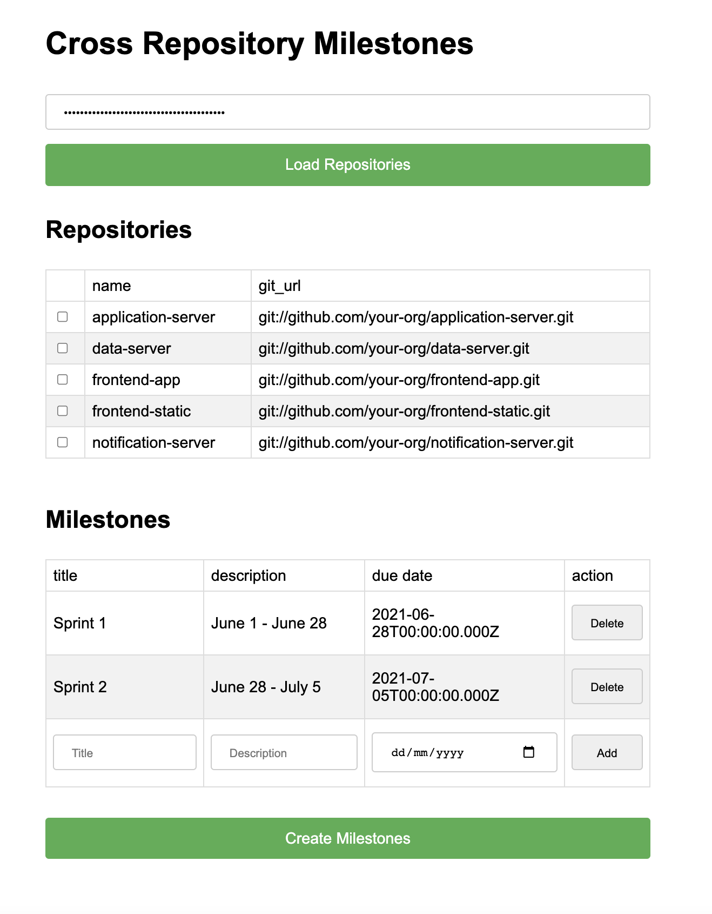

# Cross Repository Milestones for GitHub

A modern tool to create identical milestones across multiple GitHub repositories simultaneously.

## Features

- Clean, modern UI built with Tailwind CSS
- Create consistent milestone titles, descriptions, and due dates across repositories
- Select specific repositories from your GitHub account
- Visual feedback on milestone creation status

## Getting Started

### GitHub Access Token

1. Create a GitHub Personal Access Token following the [official documentation](https://docs.github.com/en/authentication/keeping-your-account-and-data-secure/creating-a-personal-access-token)
2. Ensure your token has the `repo` scope to access and modify repository data

### Running the Application

Simply open `index.html` in your browser - no build steps required.

## Usage

1. Enter your GitHub Personal Access Token
2. Click "Load Repositories" to fetch all repositories you have access to
3. Select repositories where you want to create milestones 
4. Add milestone details (title, description, due date)
5. Click "Create Milestones" to apply them to all selected repositories

## Project Structure

- `index.html` - Main HTML file with the user interface
- `script.js` - JavaScript code handling all application logic and API interactions
- Tailwind CSS is loaded via CDN

## Technologies

- HTML5
- Tailwind CSS (via CDN)
- Vanilla JavaScript
- GitHub REST API via Octokit

## Screenshot

## License

MIT
